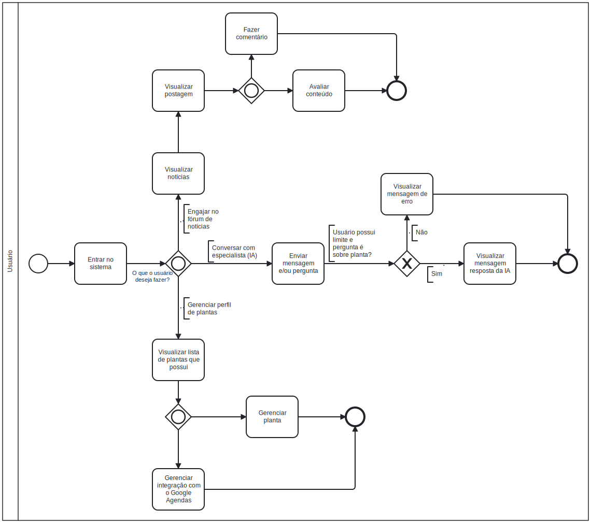

# Fluxo de Uso

 O diagrama abaixo apresenta uma visão geral do fluxo de uso do sistema, destacando as principais etapas e interações entre o usuário e a aplicação. Ele foi elaborado para facilitar a compreensão do comportamento do sistema em diferentes cenários de uso, servindo como uma ferramenta de apoio tanto para o desenvolvimento quanto para a validação das funcionalidades propostas.

Esse fluxo visual ajuda a identificar os pontos de entrada e saída, decisões importantes e possíveis ramificações, contribuindo para uma melhor comunicação entre equipe técnica, stakeholders e demais envolvidos no projeto.

# Referências Bibliográficas

> <a id = "um">1</a> TOTVS, E. BPMN: entenda o que é a modelagem de processos de negócios, como fazer e sua importância! Disponível em: <https://www.totvs.com/blog/gestao-industrial/bpmn/>.
>
> <a id = "dois">2</a> Jacobson, Ivar; Booch, Grady; Rumbaugh, James. *The Unified Software Development Process.* Addison-Wesley, 1999.
>
> <a id = "tres">3</a> Cockburn, Alistair. *Writing Effective Use Cases.* Addison-Wesley, 2000.
>
