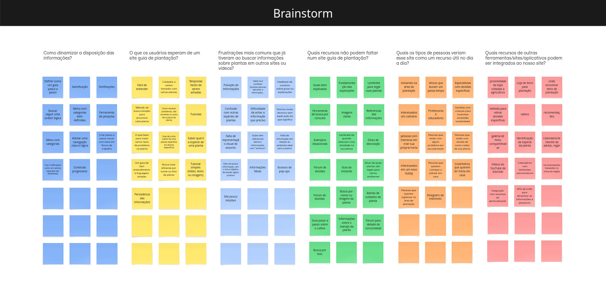
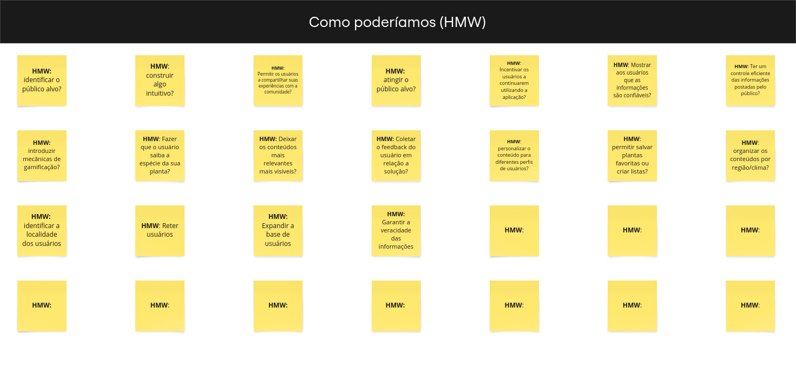
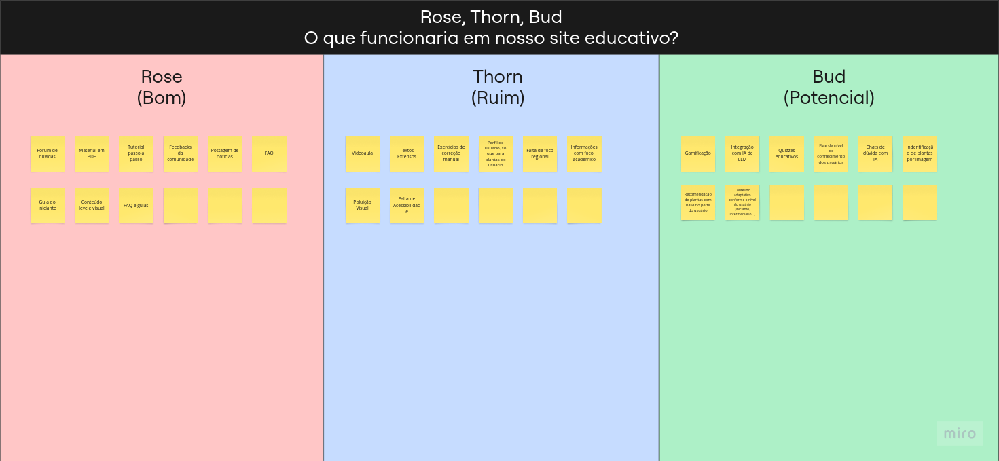

# Understand

A fase de **Understand** é a base sobre a qual todo o Design Sprint é construído. Seu principal objetivo é garantir que todos os participantes tenham um entendimento profundo, compartilhado e alinhado sobre o problema que será enfrentado. Nesse momento, o foco não está em encontrar soluções, mas sim em mergulhar no contexto do desafio, levantar informações relevantes e criar uma visão completa do cenário que envolve usuários, objetivos e possíveis obstáculos. Para isso, é fundamental a colaboração de toda a equipe, com escuta ativa, pensamento crítico e abertura para diferentes pontos de vista.

No nosso projeto, voltado para o gerenciamento de plantas e o agendamento de cuidados, essa etapa foi essencial para compreender não apenas o que o usuário precisa, mas também como ele interage com esse tipo de solução no dia a dia. Iniciamos com a técnica do **Boot Up Note Taking**, onde cada integrante anotou suas percepções, experiências pessoais e primeiras ideias relacionadas ao problema. Essa abordagem individual permitiu que cada voz fosse ouvida desde o início, evitando vieses e influências prematuras, e criando um ponto de partida rico para discussões mais profundas.

Em seguida, aplicamos o método **Rose, Thorn, Bud**, uma dinâmica que nos ajudou a categorizar os elementos do problema de forma clara: os pontos positivos existentes no cenário atual (roses), as dificuldades e barreiras percebidas (thorns), e as oportunidades e ideias em potencial (buds). Essa reflexão coletiva foi essencial para identificar áreas críticas e possibilidades de inovação dentro do domínio do projeto.

Por fim, realizamos uma sessão de **Brainstorm** para expandir ao máximo nosso repertório de ideias, dúvidas e provocações. Nesse momento, buscamos ir além do óbvio, levantando hipóteses e questões que poderiam direcionar melhor os próximos passos. Essa atividade também nos ajudou a visualizar a complexidade do problema e a importância de abordá-lo de maneira empática e centrada no usuário.

Ao final da fase de Understand, conseguimos estabelecer uma base sólida de conhecimento compartilhado entre todos os membros do grupo. Essa base não apenas norteou as decisões futuras do projeto, mas também garantiu que cada escolha fosse respaldada por uma compreensão real e coletiva do desafio que estávamos dispostos a resolver.

## Brainstorm

Para o Brainstorm do nosso projeto, utilizamos o **Miro** como ferramenta colaborativa. A atividade foi estruturada a partir de **seis perguntas principais**, elaboradas para explorar diferentes aspectos do desafio relacionado ao cuidado com plantas. Cada membro da equipe contribuiu com ideias e respostas por meio de **stickies**, preenchendo o board com sugestões, dúvidas e observações.

O foco foi gerar o máximo de contribuições possíveis, sem julgamentos, promovendo uma visão ampla do problema. O resultado foi um conjunto rico de insights que serviu de base para as próximas etapas do Design Sprint.

<iframe width="768" height="432" src="https://miro.com/app/embed/uXjVIG9iqTs=/?pres=1&frameId=3458764623738653172&embedId=306523643298" frameborder="0" scrolling="no" allow="fullscreen; clipboard-read; clipboard-write" allowfullscreen></iframe>

## How Might We (HMW)

A técnica **How Might We (HMW)** foi utilizada para transformar os desafios identificados em oportunidades de design. A partir das ideias e dores levantadas durante o Brainstorm e outras dinâmicas, cada membro da equipe escreveu perguntas no formato "Como poderíamos..." com o objetivo de abrir espaço para soluções criativas e centradas no usuário.

As frases foram criadas de forma colaborativa no **Miro**, baseando-se nas necessidades observadas no contexto do cuidado com plantas. Essa abordagem nos ajudou a reformular problemas em possibilidades, gerando direcionamentos claros para ideação futura.

<iframe width="768" height="432" src="https://miro.com/app/embed/uXjVIG9iqTs=/?pres=1&frameId=3458764623738653497&embedId=372914487578" frameborder="0" scrolling="no" allow="fullscreen; clipboard-read; clipboard-write" allowfullscreen></iframe>

## Rose, Thorn, Bud

A técnica **Rose, Thorn, Bud** foi aplicada para analisarmos de forma simples e visual os aspectos positivos, negativos e as oportunidades relacionadas ao nosso projeto. Utilizamos o **Miro** para organizar os pensamentos da equipe em três categorias:

- **Rose (Rosa)**: elementos positivos que já existem ou funcionam bem;
- **Thorn (Espinho)**: problemas, dificuldades ou limitações percebidas;
- **Bud (Brotos)**: ideias com potencial ou oportunidades a serem exploradas.

Cada integrante contribuiu com seus pontos de forma colaborativa, utilizando stickies coloridos para identificar cada categoria. O resultado foi uma visão mais clara do cenário atual, ajudando a equipe a entender onde melhorar e onde inovar.

<iframe width="768" height="432" src="https://miro.com/app/embed/uXjVIG9iqTs=/?pres=1&frameId=3458764623739251695&embedId=907861629269" frameborder="0" scrolling="no" allow="fullscreen; clipboard-read; clipboard-write" allowfullscreen></iframe>

## Bibliografia

> GOOGLE. How Might We. Disponível em: https://designsprintkit.withgoogle.com/methodology/phase1-understand/hmw-sharing-and-affinity-mapping.

> GOOGLE. Phase 1: Understand. Disponível em: https://designsprintkit.withgoogle.com/methodology/phase1-understand.

> GOOGLE. Rose, Thorn, Bud. Disponível em: https://designsprintkit.withgoogle.com/methodology/phase1-understand/rose-thorn-bud.

## Histórico de Versão

| Versão | Data | Descrição | Autor(es) |
| :-: | :-: | :-: | :-: |
| `1.0` | 10/04/2025  | Especificação da fase de Understand | [Mateus Vieira](https://github.com/mateusvrs) |
