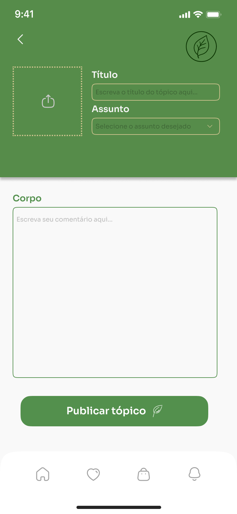

# Protótipos - Projeto Plante Vc Mesmo 

Nosso grupo desenvolveu uma série de **protótipos interativos** com o objetivo de ilustrar o funcionamento e a navegação da plataforma **Plante Vc Mesmo**. O foco principal do projeto é facilitar o cuidado com plantas por meio de uma plataforma intuitiva, acessível e funcional para usuários de todos os níveis de experiência.

Para a criação dos protótipos, utilizamos a ferramenta **Figma**, que nos permitiu projetar e testar interfaces de forma colaborativa e eficiente. Através dela, conseguimos representar fielmente o fluxo de navegação e os principais recursos da plataforma.

A seguir, apresentamos as principais páginas prototipadas:

---

## 1. START PAGE
Página de boas-vindas, com opções para login, cadastro e uma breve introdução à plataforma.

## 2. HOME PAGE
Página inicial do usuário logado, com acesso rápido às suas plantas, lembretes, dicas e notícias em destaque.

## 3. TUTORIAL PAGE
Tela interativa com um passo a passo para ensinar os novos usuários a utilizar a plataforma de forma completa.

## 4. SHOP PAGE
Loja integrada com recomendações personalizadas de produtos como vasos, adubos, ferramentas e mudas.

## 5. PRODUCT PAGE
Página com detalhes de um produto específico, incluindo descrição, avaliações, preço e opção de compra.

## 6. FORUM PAGE
Espaço colaborativo da comunidade, onde usuários podem ver tópicos em discussão, tirar dúvidas e trocar experiências.

## 7. NEW TOPIC PAGE
Formulário para que o usuário crie um novo tópico no fórum, categorizando o assunto e descrevendo sua dúvida ou contribuição.

## 8. VIEW TOPIC PAGE
Página de visualização de um tópico específico do fórum, com comentários, curtidas e marcação de respostas úteis.

## 9. PROFILE PAGE
Perfil do usuário, onde é possível ver suas plantas cadastradas, conteúdo salvo, atividades no fórum e preferências.

---

<iframe style="border: 1px solid rgba(0, 0, 0, 0.1);" width="800" height="450" src="https://embed.figma.com/design/Lldetnev66nP3opNDcxtkX/Plante-Vc-Mesmo?node-id=59-591&embed-host=share" allowfullscreen></iframe>

<b>Autor:</b>  [Mateus Vieira, Caio Lamego, Arthur Ribeiro](/), 2025

## Histórico de Versão

| Versão | Data | Descrição | Autor(es) |
| :-: | :-: | :-: | :-: |
| `1.0` | 10/04/2025  | Especificação da fase de Prototipagem | [Matheus Brant](https://github.com/MatheussBrant) |