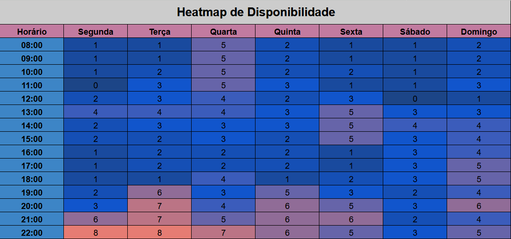

# Heatmap

## Sobre o heatmap

Um heatmap(mapa de calor) é um método gráfico para exibir informações, onde diferentes cores representam níveis variados de atividade ou valor. Imagine um mapa de calor como uma ferramenta que destaca as zonas de maior acesso em um website, as áreas mais impactadas por uma enfermidade ou as temperaturas médias em uma nação. Ele é útil para revelar padrões, tendências ou discrepâncias nos dados, o que auxilia na análise e decisão.

Em nosso contexto, empregamos o mapa de calor para mapear a disponibilidade de tempo dos membros do time, considerando seus compromissos pessoais, profissionais e educacionais. Essa visão nos capacita a planejar encontros de maneira mais eficaz e considerada, antecedendo possíveis choques de horários. 

## Resultados
Para mapear a disponibilidade dos membros da equipe, foi criada uma planilha compartilhada onde cada integrante registrou seus horários livres ("1") e ocupados ("0") ao longo da semana. Esses dados foram consolidados em uma página de resumo, que calculou a soma de disponibilidades por horário de cada integrante, permitindo a geração de um heatmap.

As cores mais quentes (vermelho) indicam os horários com maior sobreposição de agendas livres, enquanto as cores mais frias (azul) marcam períodos com menor disponibilidade. Os encontros para desenvolvimento do projeto ocorreram majoritariamente no período entre 20h e 22h durante a semana. Esse horário foi escolhido para a maioria dos encontros da primeira entrega.

Tabela 1: Heatmap.

Fonte: [Gabriel Fernando de Jesus Silva](https://github.com/MMcLovin), 2025.

## Bibliografia

> 1. All About Heatmaps. Disponível em: [https://towardsdatascience.com/all-about-heatmaps-bb7d97f099d7](https://towardsdatascience.com/all-about-heatmaps-bb7d97f099d7). Acesso em: 09 de abr. de 2025.
>

## Histórico de Versões

| Versão | Data | Descrição | Autor(es) | 
| :----: | :--: | --------- | ----------- | 
| `1.0`  | 09/04/2025 | Criação do documento | [Gabriel Fernando de Jesus Silva](https://github.com/MMcLovin)  | 
