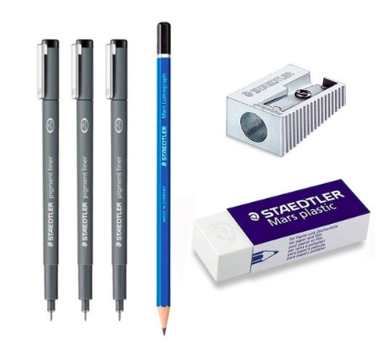

# Ferramentas Utilizadas

## Introdução

Artefato destinado a documentar as ferramentas utilziadas durante a entrega 1.

Tabela 1 - Ferramentas utilizadas na entrega 1.

| Logo | Ferramenta | Finalidade |
| :--: | ---------- | :--------- |
|  | Docsify | Geração da documentação do gitpages em páginas estáticas |
|  | Visual Studio Code | Criação e edição dos arquivos de documentação |
|  | WhatsApp | Comunicação via chat com a equipe |
|  | Google Planilhas | Produção de tabelas compartilhadas para realização do heatmap |
|  | Online Markdown Editor | Edição de arquivos em markdown |
|  | Google Forms | Produção e distribuição de questionário para perfil do usuário |
|  | Draw.io | Produção do BPMN |
|  | Figma | Confecção do protótipo |
|  | Miro | Elaboração dos artefatos da Design Sprint e Artefatos Generalistas |
|  | GitHub | Repositório git online para armazenar a produção da equipe |
|  | Git | Controle de versionamento de código |
|  | Materiais de escrever | Confecção das ideias desenvolvidas na técnica Crazy 8 |
|  | Papel | Confecção das ideias desenvolvidas na técnica Crazy 8 |
|  | Smartphone | Comunicação entre a equipe |
|  | Notebook | Desenvolvimento do projeto |

Fonte: [Gabriel Fernando de Jesus Silva][GabrielFGH], 2025.

## Bibliografia

> 1. GitHub. Disponível em: [https://docs.github.com/pt](). Acesso em: 09 de abr. de 2025.
>
> 2. Docsify. Disponível em: [https://docsify.js.org/#/](). Acesso em: 07 de abr. de 2025.
>
> 3. Visual Studio Code. Disponível em: [https://code.visualstudio.com/](). Acesso em: 09 de abr. de 2025.
>
> 4. WhatsApp. Disponível em: [https://www.whatsapp.com/](). Acesso em: 09 de abr. de 2025.
>
> 5. Google Forms. Disponível em: [https://www.google.com/intl/pt-BR/forms/about/](). Acesso em: 09 de abr. de 2025.
>
> 6. Google Planilhas. Disponível em: [https://www.google.com/sheets/about/](). Acesso em: 09 de abr. de 2025.
>
> 7. Draw.io. Disponível em: [https://app.diagrams.net/](). Acesso em: 09 de abr. de 2025.
>
> 8. Figma. Disponível em: [https://www.figma.com/about/](). Acesso em: 09 de abr. de 2025.
>
> 9. Git. Disponível em: <https://git-scm.com/>. Acesso em: 09 de abr. de 2025.
>
> 10. Online Markdown Editor. Disponível em: <https://onlinemarkdowneditor.dev/>. Acesso em: 09 de abr. de 2025.
>
> 10. Miro. Disponível em: [https://miro.com/pt/](). Acesso em: 09 de abr. de 2025.

## Histórico de Versões

| Versão | Data | Descrição | Autor(es) | 
| :----: | :--: | --------- | ----------- | 
| `1.0`  | 09/04/2025 | Criação do documento | [Gabriel Fernando de Jesus Silva][GabrielFGH]  | 

[GabrielFGH]: https://github.com/MMcLovin